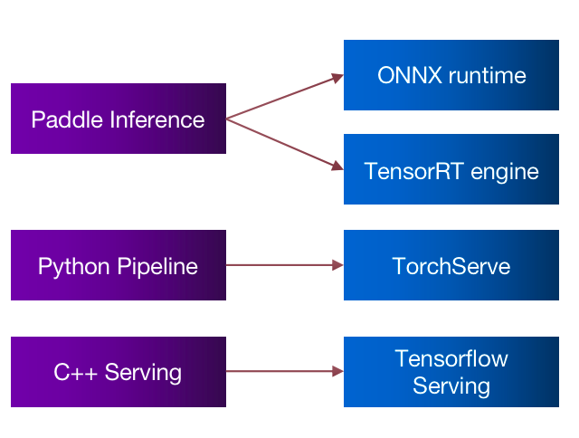
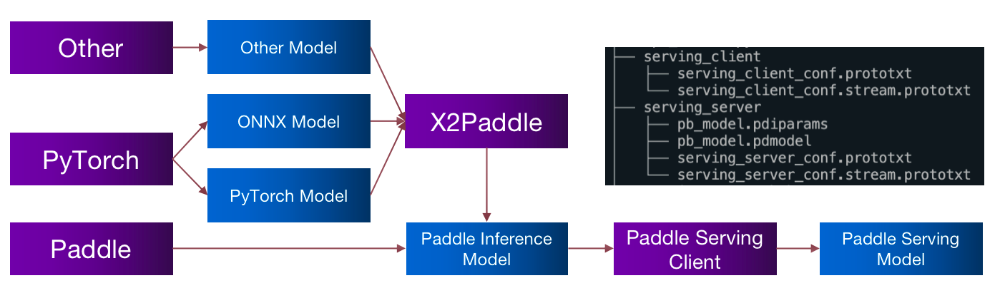
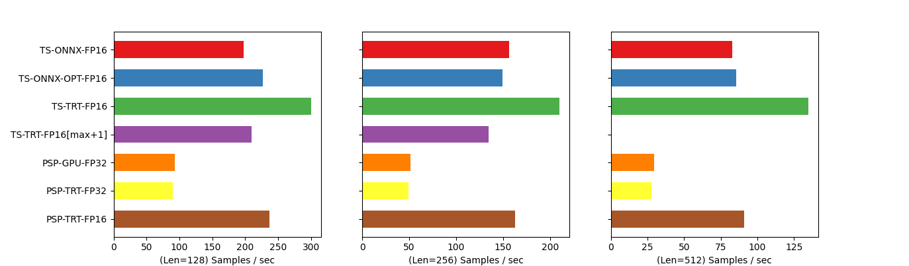
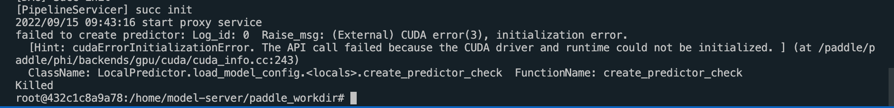
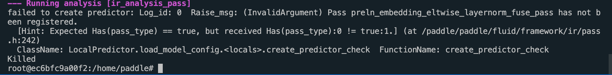
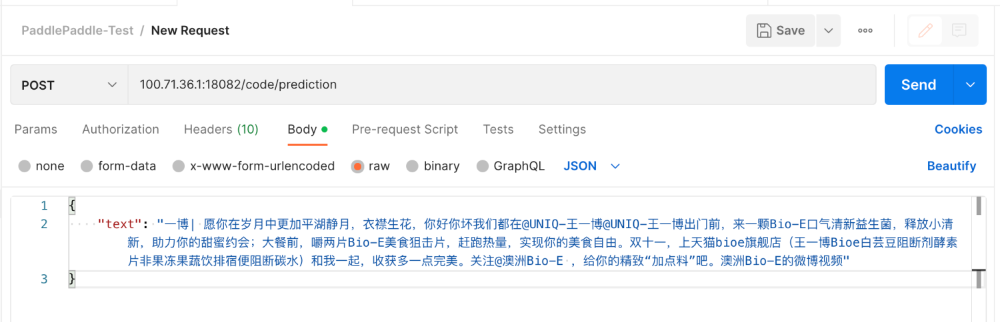
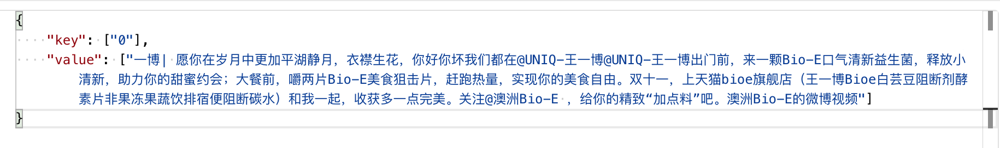

# Paddle-Serving-Experience

> 之前使用过 tensorflow serving、torchserve 以及 FastAPI 的模型部署方式，考虑到还未践行过国产框架的部署实践。本文主要从服务框架的使用者角度，记录了实现paddle模型的部署过程，以及在使用其他类型的模型（比如 ONNX）相关模型中遇到的一些问题以及解决办法。

# 1. Paddle Serving
　　Paddle Serving 从笔者来看，是一个实现Model As a Service（MaaS）的服务框架。不管是用什么框架（Pytorch、Tensorflow、PaddlePaddle）训练出来的模型本质上都是一个个服务，那么如果想用 API 来使用模型，那么把模型通过一些方式发布成为服务就是必不可少的。最简单的方式，自然是使用对应的框架来load 模型，然后使用 Fask API /Flask 等框架部署成服务。但是使用这样简单的服务来部署服务，显然无法满足工业上使用要求（不够稳定、性能不足等）。那么自然而然的会衍生出非常多的框架来实现 MaaS 的服务，比如 Google 的 Tensorflow Serving，Meta 的 Torch Serve 等，百度的Paddle Serving，本期内容主要用于介绍 Paddle Serving。
在Paddle Serving 中提到了非常多的服务概念比如 Pipeline、C++ Serving、Paddle Inference，那么 Paddle Serving提供的组件与传统的Tensorflow serving、TrochServe 等服务在使用上的异同是什么样的呢？

<div align=center>
    
</div>

Paddle Inference：原生推理库，可以在 python脚本中启动的推理引擎，比如可以Flask 就可以完成服务的封装，可以与TensorRT 的 engine，ONNX的onnxruntime对应。
Python Pipeline：可以在服务中使用各种前后处理，并且在模型的调度上进行异步化的处理，可以与 TorchServe 对应。
C++ Serving：使用C++编译的二进制模型服务引擎，与 tensorflow serving 对应。

# 1. 部署
## 1.1 环境准备
> 此处环境主要使用docker镜像进行部署与测试，具体dockerfile环境见4.1节，

基础环境：ubuntu 20.0 + cuda 11.4.2 + tensorRT 8.0.3.4 + cuDNN 8.2.4.15 + NCCL 2.11.4
Paddle Serving 环境：
```
paddle-bfloat             0.1.7
paddle-serving-app        0.9.0
paddle-serving-client     0.9.0
paddle-serving-server-gpu 0.9.0.post112
paddle2onnx               1.0.0
paddlefsl                 1.1.0
paddlenlp                 2.4.0
paddlepaddle-gpu          2.3.2.post112
```

## 1.2 服务部署
> 服务镜像已经在 harbor准备好了，可以直接使用，registry.paas/nlp/paddle-serve-base-cuda114:0.9.0

1. 基于 dockerfile 的镜像准备，进入 [dockerfile](./docker) 目录执行以下命令。
```commandline
docker build -t paddle-serving-base .
```


2. 模型准备

　　Paddle Serving 不管是 Pipeline 模式还是 C++ Serving 模式支持的模型结构都是 Paddle Serving Model 的形式，不管是什么类型的模型，都需要经过Model -> Inference Model -> Serving Model 的形式，才可以使用 Paddle Serving服务框架的形式启动起来，使用各类框架如何训练 Model，此处不做具体介绍。具体可以自行摸索。
<div align=center>
    
</div>

- Model 转换为 Inference Model

　　第一步是将模型转换为 Paddle Inference 可以使用的静态模型，具体的针对不同类型的模型，大致可以分为两种转换途径。

（1）Paddlepaddle 框架模型

如果是基于 PaddlePaddle 框架训练的模型，相对来说比较简单，可以直接使用paddle.jit 中的 to_static 工具进行转换，具体如下：
```python
import paddle
from paddle.jit import to_static
from paddle.static import InputSpec
from paddlenlp.transformers.bert.modeling import BertForSequenceClassification

# 以 BERT 模型为例
paddle_model = BertForSequenceClassification.from_pretrained('bert-base-chinese')
paddle_model.eval()

# 定义输入参数
input_ids = InputSpec([None, None], 'int64', 'input_ids')
token_type_ids = InputSpec([None, None], 'int64', 'token_type_ids')
attention_mask = InputSpec([None, None], 'int64', 'attention_mask')

# 导出静态模型
model = to_static(paddle_model, 
                  input_spec=[input_ids, token_type_ids, attention_mask])
paddle.jit.save(model, 'pb_model')
```
（2）Paddlepaddle 框架模型

　　如果是非 PaddlePaddle 框架模型，有两种方式：(a)如 Pytorch 模型，可以读取其参数，然后通过paddle_model.load_dict，将模型的转换为 paddlepaddle 模型，然后再进行正常的转换操作。（b）可以直接使用X2Paddle 工具将模型转换为 Inference Model的形式（一行代码即可）。
```python
# 以 onnx fp32的模型转换为例
from x2paddle.convert import onnx2paddle

onnx2paddle('pytorch_model.onnx', "inference_model")
```

- Inference Model转Paddle Serving Model

　　Inference Model 转为 Paddle Serving Model 相对还是比较简单的，只需要一行代码即可实现对应模型的转换，需要注意的一点是PaddlePaddle2.0之前模型和之后的模型结构不同，参数需要进行一些小的修改。
```python
import paddle_serving_client.io as serving_io

serving_io.inference_model_to_serving("serving_model",
                                      serving_server="serving_server", 
                                      serving_client="serving_client",
                                      model_filename='pb_model.pdmodel', 
                                      params_filename='pb_model.pdiparams')
```

3. 基于镜像启动服务

　　镜像分别开启了 RPC 的服务端口8088，以及 http 的服务端口18082，具体的代码可以参考：[这里](./examples/bert/pipeline)
```
nvidia-docker run -itd \
        -p 39999:18082 \
        -p 39998:8088 \
        -v /paddle_workdir/serving_server:/home/model-server/serving_server \
        paddle-serving-base bash
```


## 2.3 服务启动

1. 修改配置，具体配置参数请参考[此处](./examples/bert/pipeline/config.yml)，也可以参考官方的配置进行，总体来说，需要注意的配置主要如下几项，包括使用什么样的 Serving模式，是否使用自动优化，是否使用 GPU/TRT ：

```yaml
# 当op配置没有server_endpoints时，从local_service_conf读取本地服务配置
local_service_conf:
  # client类型，包括brpc, grpc和local_predictor.local_predictor不启动Serving服务，进程内预测
  client_type: local_predictor
  #ir_optim
  ir_optim: True
  # device_type, 0=cpu, 1=gpu, 2=tensorRT, 3=arm cpu, 4=kunlun xpu
  device_type: 2
```

2. 启动服务：python3 [cls_server.py](./examples/bert/pipeline/cls_service.py)
3. 验证服务：可以基于RPC客户端或者HTTP客户端进行服务验证，具体可参考官网。

## 2.4 测试与对比
此处只是进行了简单的 demo 测试，模型选择的是最简单的 BERT+CLS 的分类模型，此外，默认所有模型均开启了动态shape，本次结果如有不足之处，请及时指出。
测试工具：jmeter + 20线程 + 200 Loop
测试环境：T4（服务端）+ MBP（本地）
测试模型：BERT+CLS
测试指标：TPS（吞吐量）
测试样例：
```json
{
    "key": ["0"],
    "value": ["一博| 愿你在岁月中更加平湖静月，衣襟生花，你好你坏我们都在，"]
}
```
测试结果：其中 TS（torchserve）、TRT（TensorRT）、PSP（Paddle Serving Pipeline）

<div align=center>
    
</div>


- ~~遗留问题1：在 TorchServe 中的 TRT 哪怕设置支持动态 shape 的输入，其运行速度也会受到engine 中 context申请的 shape 大小而影响，因此此处设置了256/512的2个指定 shape 进行测试，此处方案待优化验证。~~
 - TRT虽然支持动态输入，但是实际还是使用固定的 `Binding Shape`，如果 `input_ids` 超过其长度，则会进行截断。TRT性能与其设定的 `Binding Shape` 直接相关，与输入的`inputs`无关，因此 TRT 的动态输入与传统意义上的动态输入还不大一样，因此，一种取巧的办法就是一开始就定义多个 `profile` [128, 256, 512]，性能在[128，256，512]的时候能够达到对应的性能的极致，但是在长度为当前设定上限 `max + 1`时，对应性能则会迅速降低（选择了其他的参数模板）。
```python
# 重点
max_seq_length_list = [128, 256, 512]
# 动态输入时候需要 分别为最小输入、常规输入、最大输入
for max_seq_length in max_seq_length_list:
    profile = builder.create_optimization_profile()
    min_shape = (1, max_seq_length)
    opt_shape = (1, max_seq_length)
    max_shape = (1, max_seq_length)
    # 注意自己有几个输入，有几个输入就要写几个profile.set_shape, 名字和转onnx的时候相对应
    profile.set_shape('input_ids', min_shape, opt_shape, max_shape)
    profile.set_shape('attention_mask', min_shape, opt_shape, max_shape)
    profile.set_shape('token_type_ids', min_shape, opt_shape, max_shape)
    config.add_optimization_profile(profile)
```

- 遗留问题2：非常奇怪的是，在Pipeline 的 TRT 方案中，FP32的性能反而比 GPU 的性能还差，但是使用了 FP6之后，整体性能有差不多是 GPU 性能的2倍，该问题待解释。

# 3. 总结
总体来说，PaddleServing Pipeline 版本能够快速实现 NLP的常见数据处理，并且能够支持昇腾等国产化芯片，此外能够使用 TRT+FP16的话，性能整体上还是比较有优势的。

当然也存在一些缺点，在验证的过程中也发现不少的问题需要进行吐槽，比如兼容性的问题（可能也是由于TRT本身的兼容性导致的），再比如在 GPU 上暂时不支持 FP16的转换的问题（是否需要提前转换为 FP16然后再使用 GPU 进行推理，待验证），此外 Paddle Serving 目前支持的 TRT 版本最高只有8.0版本，提的issue也没有什么及时的回复，官方群也没啥回复，版本更新也比较慢（这个项目是要放弃了吗？）。

# 4. 其他
## 4.1 服务报错：CUDA  driver and runtime could not be initialized



参考：[https://github.com/PaddlePaddle/PaddleOCR/issues/3070](https://github.com/PaddlePaddle/PaddleOCR/issues/3070)
原因：Paddle Serving 多线程，需要在子进程中进行import paddle 相关依赖，问题解决。

```python
# 错误，不可以在全局进行依赖导入
from paddlenlp.transformers.bert.faster_tokenizer import BertFasterTokenizer

# ============================================================================
class BertOp(Op):
    tokenizer = None

    def init_op(self):
        # 正确，需要在子进程导入相关依赖
		from paddlenlp.transformers.bert.faster_tokenizer import BertFasterTokenizer
        self.tokenizer = BertFasterTokenizer.from_pretrained('bert-base-chinese')
```

## 4.2 TRT 转换出现额外需要设置的动态输入
原因：Paddle Serving 本身转 TRT 的问题，毕竟不是原生TRT的转换，PaddlePaddle 的 BertModel不是原生的BertModel，从默认的 vocab_size 可以看出，应该是属于 ERNIE的 base，转 TRT 的时候，如果使用动态向量，则需要增加一个多个动态向量的设置，并且在不同的 tensorrt 版本不同的模型中对应需要动态设置的变量还不一定一样。
比如此处`unsqueeze2_0.tmp_0`的额外设置。

```python
 def set_dynamic_shape_info(self):
        min_input_shape = {
            "input_ids": [1, 1],
            "token_type_ids": [1, 1],
            "attention_mask": [1, 1],
            "unsqueeze2_0.tmp_0": [1, 1, 1, 1]
        }
        max_input_shape = {
            "input_ids": [10, 512],
            "token_type_ids": [10, 512],
            "attention_mask": [10, 512],
            "unsqueeze2_0.tmp_0": [10, 1, 1, 512]
        }
        opt_input_shape = {
            "input_ids": [1, 512],
            "token_type_ids": [1, 512],
            "attention_mask": [1, 512],
            "unsqueeze2_0.tmp_0": [1, 1, 1, 512]
        }

        self.dynamic_shape_info = {
            "min_input_shape": min_input_shape,
            "max_input_shape": max_input_shape,
            "opt_input_shape": opt_input_shape,
        }

```
## 4.3 遇到 preln_embedding_eltwise_layernorm_fuse_pass has not been registered


原因：通过 pip 安装的 paddlepaddle-gpu没有带 TRT 相关的依赖。

参考：[PaddleDetection使用TensorRT，对进行yolov3_mobilenet_v1_qat推理时报错 · Issue #5971 · PaddlePaddle/PaddleDetection](https://github.com/PaddlePaddle/PaddleDetection/issues/5971)

解决：[下载安装Linux预测库-PaddlePaddle深度学习平台](https://www.paddlepaddle.org.cn/inference/v2.3/user_guides/download_lib.html#python)

```yaml
pip install https://paddle-inference-lib.bj.bcebos.com/2.3.2/python/Linux/GPU/x86-64_gcc8.2_avx_mkl_cuda11.2_cudnn8.2.1_trt8.0.3.4/paddlepaddle_gpu-2.3.2.post112-cp38-cp38-linux_x86_64.whl
```

## 4.4 使用HTTP 接口未接收到数据
使用以下配置启动服务，使用 http 接口请求服务时：

查看web_server.py 中的 input_dict打印结果，发现没有传入任何参数，{'@DAGExecutor': {}}
HTTP 需要使用制定的参数格式（与 read_op 的定义有关）：

## 4.5 无法指定日志地址以及日志级别
Paddle Serving 中 Pipeline模式使用的日志默认由 logging 模块提供，`logging.config.dictConfig(logger_config)`，如果要修改默认日志，需要reload 日志的配置。

# 5. Reference
> [1] [https://github.com/PaddlePaddle/Serving](https://github.com/PaddlePaddle/Serving)\
> [2] [https://github.com/PaddlePaddle/PaddleOCR/issues/3070](https://github.com/PaddlePaddle/PaddleOCR/issues/3070)\
> [3] [https://github.com/PaddlePaddle/PaddleDetection/issues/5971](https://github.com/PaddlePaddle/PaddleDetection/issues/5971)\
> [4] [https://docs.nvidia.com/deeplearning/tensorrt/developer-guide/index.html#work_dynamic_shapes](https://docs.nvidia.com/deeplearning/tensorrt/developer-guide/index.html#work_dynamic_shapes)
